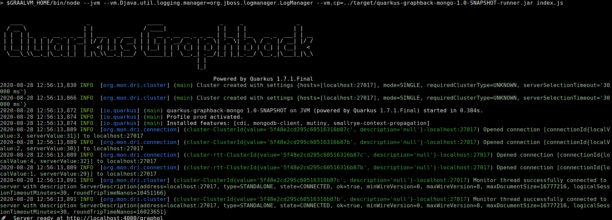

# quarkus-graphback-mongo

A sample and experimental polyglot Java and JavaScript app to show interaction between [Quarkus](https://quarkus.io/) and [Graphback](https://graphback.dev/).

This app is highly based on the example given in [Using the Quarkus Mongo Client Extension](https://quarkus.io/guides/mongodb). 

The idea is to leverage the Mongo client provided by the extension and use some of [Graphback capabilities](https://graphback.dev/docs/crud/overview) 
to expose a [GraphQL Crud API](https://graphqlcrud.org/).
   

## Running 

Make sure you have tools and software installed. 

- https://www.graalvm.org/ 
- https://www.npmjs.com/

build the datasource
```bash
./mvnw clean install
```

Start the MongoDB server on another terminal tab using the provided `docker-compose.yml` file.
``bash
docker-compose up
``

After that the app can be ran with
```bash
cd app
npm start
```

NB: Make sure that `$GRAALVM_HOME` is set on your PATH.

This will start in `http://localhost:4000`.



## Playground

Open your browser to `http://localhost:4000/graphql`.

Use the below queries to play a little with the application. 

> NOTE: We use the id `5f48c5027b5bfb2bfcc7e53b` for sake of completeness, replace this value with the one generated for you. 

## Create A Fruit

```graphql
mutation {
  createFruit(input: {name: "apple", description: "Apple description"}) {
    _id, 
    name,
    description
  }
}
```

## Update A Fruit

```graphql
mutation {
  updateFruit(input: {_id: "5f48c5027b5bfb2bfcc7e53b" description: "apple long description"}) {
    _id, 
    name,
    description
  }
}
```

## List Fruits

### List All

```graphql
query {
  findFruits {
    items {
      _id,
      name,
      description
    }
    count
  }
}
```

## Find Fruit by ID

```graphql
query { 
  getFruit(id: "5f48c5027b5bfb2bfcc7e53b") {
    _id
    name
    description
  }
}
```

## Delete Fruit

```graphql
mutation {
  deleteFruit(input: {_id: "5f48c5027b5bfb2bfcc7e53b"}) {
    _id, 
    name,
    description
  }
}
```

# Conlusion

This was an exercise I decided to kickstart my Learning Day that my company accorded to all employee. Combining my experiences in both of these frameworks was fun. 
1. It should be possible to make the data provider generic enough so that it work with any kind of business model and more than one business model.
2. Extend the data provider with filtering capabilities
3. One possible paths that this may lead is to use the [Debezium Extension](https://debezium.io/documentation/reference/integrations/outbox.html) and use it to setup Graphback Subscriptions. 
